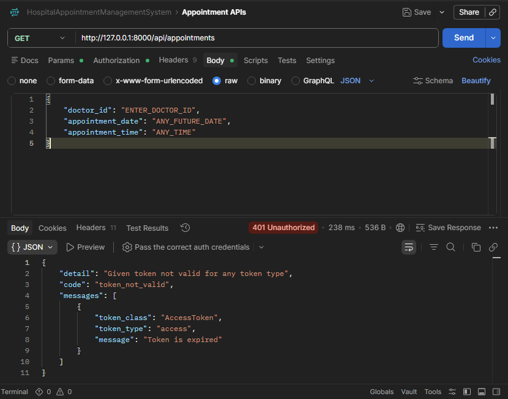
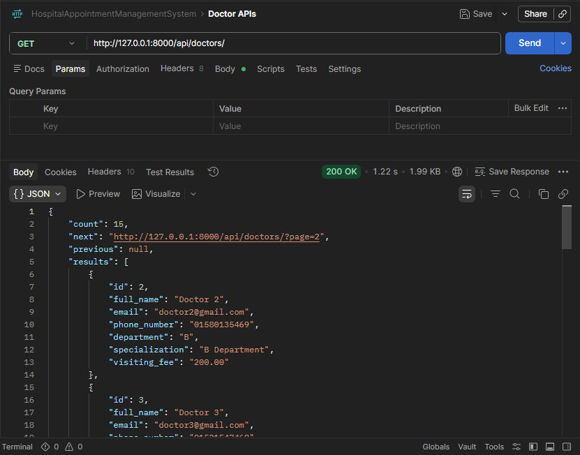
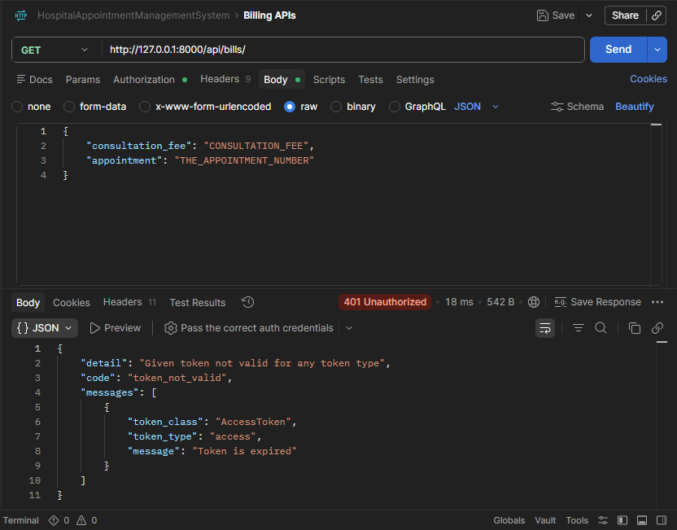
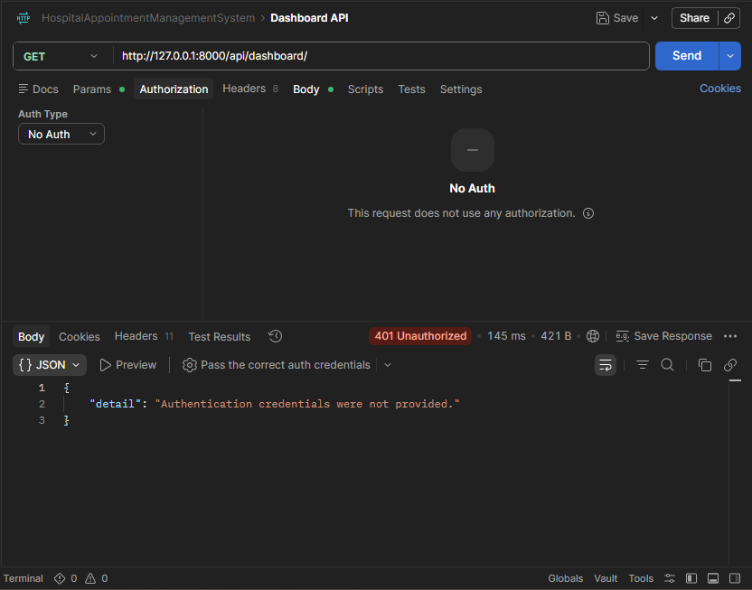

<!-- ========================================================= -->
<!--                     HOSPITAL APPOINTMENT API               -->
<!-- ========================================================= -->


<h1 align="center">
🏥 Hospital Appointment Management API
</h1>

<p align="center">
A modern, secure and scalable Hospital Appointment Management REST API built with Django REST Framework.
</p>

<p align="center">


</p>

---

<p align="center">

<a href="#installation">Installation</a> •
<a href="#api-documentation">API</a> •
<a href="#features">Features</a> •
<a href="#future-roadmap">Roadmap</a> •
<a href="#author">Author</a>

</p>

---

# 📖 About The Project

Hospital Appointment Management API is a production-ready backend system built with **Django REST Framework**.

The project provides a complete RESTful API for managing hospital appointments, doctors, patients, billing, authentication, and dashboard analytics.

It follows secure authentication using JWT and role-based authorization for Admin, Doctor, and Patient.

The architecture is modular, clean, scalable, and follows REST API best practices.

---

# 🚀 Project Highlights

✅ JWT Authentication

✅ Role Based Access Control

✅ Doctor Management

✅ Patient Management

✅ Appointment Booking

✅ Billing System

✅ Dashboard Analytics

✅ Search

✅ Filtering

✅ Ordering

✅ Pagination

✅ Profile Management

✅ Password Reset

✅ Custom Middleware

✅ Request Validation

✅ RESTful API Design

---

# 👥 User Roles

| Role | Permissions |
|-------|-------------|
| 👑 Admin | Full System Access |
| 👨‍⚕️ Doctor | View Assigned Appointments |
| 🧑 Patient | Manage Own Profile & Appointments |

---

# ✨ Features

## Authentication

- JWT Login
- Patient Registration
- Refresh Token
- Forgot Password
- Reset Password

---

## Profile Management

- View Profile
- Update Profile
- Partial Update
- Secure Access

---

## Doctor Module

- Create Doctor
- Update Doctor
- Delete Doctor
- Department
- Specialization
- Visiting Fee

---

## Appointment Module

- Book Appointment
- Appointment Status
- Update Appointment
- Cancel Appointment
- Doctor Assignment

---

## Billing Module

- Consultation Fee
- Discount
- Total Bill
- Appointment Billing

---

## Dashboard

- Total Patients
- Total Doctors
- Total Appointments
- Pending Appointments
- Completed Appointments

---

## Advanced Features

- Filtering
- Searching
- Ordering
- Pagination
- Custom Middleware
- Validation

---

# 🛠 Tech Stack

## Backend

- Python 3
- Django
- Django REST Framework
- JWT Authentication

## Database

- SQLite (Development)

> PostgreSQL Ready

---

## Authentication

- JWT Token Authentication

---

## API

- REST API

---

## Tools

- Postman
- VS Code
- Git
- GitHub

---

## Future Stack

- React.js
- Redux Toolkit
- Tailwind CSS
- Axios
- PostgreSQL
- Docker
- Nginx
- Redis
- Celery

---

# 📂 Project Structure

```text
hospital-appointment-management-api/
│
├── Accounts/
│
├── AppointmentManagement/
│
├── assets/
│
├── BillManagement/
│
├── DoctorManagement/
│
├── Dashboard/
│
├── core/
│
├── HospitalAppointment/
│   ├── __init__.py
│   ├── settings.py
│   ├── urls.py
│   ├── asgi.py
│   └── wsgi.py
│
├── .env
├── .env.example
├── .gitignore
├── db.sqlite3
├── manage.py
├── requirements.txt
│
└── README.md
```

---

# 📸 Screenshots

---

## Authentication



---

## Doctor API



---

## Appointment API


---

## Billing API



---

## Dashboard



---

# 📑 Table of Contents

- About
- Features
- User Roles
- Tech Stack
- Project Structure
- Screenshots
- Installation
- Environment Variables
- Running the Project
- API Documentation
- Authentication API
- Profile API
- Doctor API
- Appointment API
- Billing API
- Dashboard API
- Filtering
- Searching
- Ordering
- Pagination
- Middleware
- Validation
- Future Roadmap
- Contributing
- Author
- Social Links


<!-- ========================================================= -->
<!--                    INSTALLATION GUIDE                      -->
<!-- ========================================================= -->

# ⚙️ Installation

Follow the steps below to set up the project locally.

## 1️⃣ Clone the Repository

```bash
git clone https://github.com/iamdeveloperrayhan/hospital-appointment-management-api.git
```

Move into the project directory.

```bash
cd hospital-appointment-management-api
```

---

## 2️⃣ Create a Virtual Environment

### Windows

```bash
python -m venv venv
```

Activate the virtual environment

```bash
venv\Scripts\activate
```

---

### Linux / macOS

```bash
python3 -m venv venv
```

Activate

```bash
source venv/bin/activate
```

---

## 3️⃣ Install Dependencies

```bash
pip install -r requirements.txt
```

Verify installation

```bash
pip freeze
```

---

# ⚙️ Environment Variables

Create a **.env** file in the project root.

Example:

```env
SECRET_KEY=your_secret_key

DEBUG=True

ALLOWED_HOSTS=127.0.0.1,localhost

DATABASE_NAME=db.sqlite3

EMAIL_HOST=smtp.gmail.com

EMAIL_PORT=587

EMAIL_HOST_USER=your_email@gmail.com

EMAIL_HOST_PASSWORD=your_password

EMAIL_USE_TLS=True
```

> **Note:** Never commit your `.env` file to GitHub.

---

# 🗄 Database Setup

Create migrations

```bash
python manage.py makemigrations
```

Apply migrations

```bash
python manage.py migrate
```

---

# 👤 Create Superuser

```bash
python manage.py createsuperuser
```

Example

```text
Username: admin

Email: admin@example.com

Password: ********
```

---

# ▶️ Run Development Server

```bash
python manage.py runserver
```

Server URL

```text
http://127.0.0.1:8000/
```

---

# 📦 API Base URL

```text
http://127.0.0.1:8000/api/
```

Production

```text
https://your-domain.com/api/
```

---

# 📮 Testing APIs

You can test the API using

- Postman
- Insomnia
- Thunder Client
- Hoppscotch

---

# 🔐 Authentication Flow

```text
Register
      │
      ▼
Login
      │
      ▼
Access Token + Refresh Token
      │
      ▼
Authenticated Requests
      │
      ▼
Refresh Token
      │
      ▼
New Access Token
```

---

# 🔑 Authentication Headers

All protected endpoints require the following header.

```http
Authorization: Bearer <access_token>
```

Example

```http
GET /api/profile/

Authorization: Bearer eyJhbGciOi...
```

---

# 📚 API Documentation

## 🔐 Authentication APIs

| Method | Endpoint | Description |
|----------|--------------------------|----------------------------|
| POST | `/api/register/` | Register a new patient |
| POST | `/api/login/` | Login user |
| POST | `/api/token/refresh/` | Refresh access token |
| POST | `/api/forgot-password/` | Forgot password |
| POST | `/api/reset-password/` | Reset password |

---

# 📝 Register Patient

### Endpoint

```http
POST /api/register/
```

### Request Body

```json
{
  "full_name": "John Doe",
  "email": "john@example.com",
  "phone": "01700000000",
  "password": "StrongPassword123",
  "address": "Dhaka"
}
```

### Success Response

```json
{
  "full_name": "John Doe",
  "email": "john@example.com",
  "phone": "01700000000",
  "address": "Dhaka"
}
```

---

# 🔑 Login

### Endpoint

```http
POST /api/login/
```

### Request

```json
{
  "email": "john@example.com",
  "password": "password123"
}
```

### Success Response

```json
{
  "access": "jwt_access_token",
  "refresh": "jwt_refresh_token"
}
```

---

# 🔄 Refresh Token

### Endpoint

```http
POST /api/token/refresh/
```

### Request

```json
{
  "refresh": "your_refresh_token"
}
```

### Response

```json
{
  "access": "new_access_token"
}
```

---

# 🔒 Forgot Password

### Endpoint

```http
POST /api/forgot-password/
```

### Request

```json
{
  "email": "john@example.com"
}
```

### Response

```json
{
  "message": "Password reset link sent to your email."
}
```

---

# 🔑 Reset Password

### Endpoint

```http
POST /api/reset-password/
```

### Request

```json
{
  "token": "password_reset_token", // That was send in your email, Frist you need to choice Forget Password Option then we will send a token in your email you should to use this token here.
  "password": "NewStrongPassword123?"
}
```

### Response

```json
{
  "message": "Password reset successful."
}
```

---

# 📌 Authentication Notes

- JWT Authentication is used.
- Access Token is required for all protected APIs.
- Refresh Token generates a new Access Token.
- Password reset is available.
- Patient registration is public.
- All passwords are securely hashed.
- Unauthorized requests return **401 Unauthorized**.

<!-- ========================================================= -->
<!--                    PROFILE MANAGEMENT                      -->
<!-- ========================================================= -->

# 👤 Profile Management

Every authenticated user has a personal profile.

Each profile contains:

- Full Name
- Email Address
- Phone Number
- Address

Only the logged-in user can access and update their own profile.

---

## 📋 Profile APIs

| Method | Endpoint | Description | Permission |
|---------|----------|-------------|------------|
| GET | `/api/profile/` | View Profile | Authenticated User |
| PUT | `/api/profile/` | Update Full Profile | Owner |
| PATCH | `/api/profile/` | Partial Update | Owner |

---

# 📄 Get Profile

### Endpoint

```http
GET /api/profile/
```

### Headers

```http
Authorization: Bearer <access_token>
```

### Success Response

```json
{
    "id": 1,
    "full_name": "John Doe",
    "email": "john@example.com",
    "phone": "01700000000",
    "address": "Dhaka"
}
```

---

# ✏️ Update Profile

### Endpoint

```http
PUT /api/profile/
```

### Request Body

```json
{
    "full_name": "John Doe",
    "email": "john@example.com",
    "phone": "01711111111",
    "address": "Chittagong"
}
```

### Response

```json
{
    "full_name": "John Doe",
    "email": "john@example.com",
    "phone": "01711111111",
    "address": "Chittagong"
}
```

---

# 📝 Partial Update

### Endpoint

```http
PATCH /api/profile/
```

### Request

```json
{
    "phone": "01800000000"
}
```

### Response

```json
{
    "phone": "01800000000"
}
```

---

# 📌 Profile Rules

- Authentication Required
- Email must be unique
- Phone number must be unique
- User can only update own profile
- Admin cannot edit another user's profile through this endpoint

---

<!-- ========================================================= -->
<!--                    DOCTOR MANAGEMENT                       -->
<!-- ========================================================= -->

# 👨‍⚕️ Doctor Management

The Doctor module manages all doctors available in the hospital.

Only administrators can create, update, or delete doctors.

Patients and Doctors can view the doctor list.

---

## 🩺 Doctor Model

| Field | Type |
|--------|------|
| Name | String |
| Department | String |
| Specialization | String |
| Visiting Fee | Decimal |

---

## 📋 Doctor APIs

| Method | Endpoint | Description | Permission |
|---------|----------|-------------|------------|
| GET | `/api/doctors/` | View All Doctors | Public |
| POST | `/api/doctors/` | Create Doctor | Admin |
| GET | `/api/doctors/{id}/` | View Doctor | Public |
| PUT | `/api/doctors/{id}/` | Update Doctor | Admin |
| PATCH | `/api/doctors/{id}/` | Partial Update | Admin |
| DELETE | `/api/doctors/{id}/` | Delete Doctor | Admin |

---

# 📄 Get All Doctors

### Endpoint

```http
GET /api/doctors/
```

### Example Response

```json
[
    {
        "id": 1,
        "full_name": "Dr. Rahman",
        "department": "Cardiology",
        "specialization": "Heart Specialist",
        "visiting_fee": 1000
    },
    {
        "id": 2,
        "full_name": "Dr. Hasan",
        "department": "Neurology",
        "specialization": "Brain Specialist",
        "visiting_fee": 1500
    }
]
```

---

# 🔍 Get Single Doctor

### Endpoint

```http
GET /api/doctors/1/
```

### Response

```json
{
    "id": 1,
    "full_name": "Dr. Rahman",
    "department": "Cardiology",
    "specialization": "Heart Specialist",
    "visiting_fee": 1000
}
```

---

# ➕ Create Doctor

### Endpoint

```http
POST /api/doctors/
```

### Headers

```http
Authorization: Bearer <admin_access_token>
```

### Request

```json
{
    "full_name": "Doctor Name",
    "email": "doctor_email",
    "phone_number": "Doctor_phone",
    "password": "StrongPassword123",
    "department": "Doctor Department",
    "specialization": "Doctor Specialization",
    "visiting_fee": "Visiting Fee"
}
```

### Response

```json
{
    "full_name": "Doctor Name",
    "email": "doctor_email",
    "phone_number": "Doctor_phone",
    "department": "Doctor Department",
    "specialization": "Doctor Specialization",
    "visiting_fee": "Visiting Fee"
}
```

---

# ✏️ Update Doctor

### Endpoint

```http
PUT /api/doctors/1/
```

### Request

```json
{
    "full_name": "Dr. Rahman",
    "department": "Cardiology",
    "specialization": "Senior Heart Specialist",
    "visiting_fee": 1200
}
```

### Response

```json
{
    "full_name": "Dr. Rahman",
    "department": "Cardiology",
    "specialization": "Senior Heart Specialist",
    "visiting_fee": 1200
}
```

---

# 📝 Partial Update

### Endpoint

```http
PATCH /api/doctors/1/
```

### Request

```json
{
    "visiting_fee": 1500
}
```

### Response

```json
{
    "visiting_fee": 1500
}
```

---

# ❌ Delete Doctor

### Endpoint

```http
DELETE /api/doctors/1/
```

### Response

```json
{[]}
```

---

# 📌 Doctor Permissions

| User | Permission |
|------|------------|
| Admin | Full Access |
| Doctor | Read Only |
| Patient | Read Only |

---

# ⚠️ Doctor Validation Rules

- Doctor name is required
- Department is required
- Specialization is required
- Visiting fee cannot be negative
- Visiting fee must be numeric

---

# 📚 HTTP Status Codes

| Code | Meaning |
|------|----------|
| 200 | Success |
| 201 | Created |
| 204 | Deleted Successfully |
| 400 | Bad Request |
| 401 | Unauthorized |
| 403 | Permission Denied |
| 404 | Not Found |
| 500 | Internal Server Error |

---

# 💡 Example Workflow

```text
Admin Login
      │
      ▼
Create Doctor
      │
      ▼
Doctor Appears in Doctor List
      │
      ▼
Patient Views Doctor
      │
      ▼
Patient Books Appointment
```

<!-- ========================================================= -->
<!--                 APPOINTMENT MANAGEMENT                     -->
<!-- ========================================================= -->

# 📅 Appointment Management

The Appointment module allows patients to book appointments with doctors while enabling doctors and administrators to manage appointment workflows.

---

## 📋 Appointment Model

| Field | Description |
|--------|-------------|
| Patient | Appointment Owner |
| Doctor | Assigned Doctor |
| Appointment Date | Date of Appointment |
| Appointment Time | Time Slot |
| Status | Pending / Confirmed / Completed / Cancelled |

---

## 📌 Appointment Status

| Status | Description |
|---------|-------------|
| 🟡 Pending | Waiting for confirmation |
| 🔵 Confirmed | Approved by doctor/admin |
| 🟢 Completed | Appointment completed |
| 🔴 Cancelled | Appointment cancelled |

---

## 📚 Appointment APIs

| Method | Endpoint | Description | Permission |
|---------|----------|-------------|------------|
| GET | `/api/appointments/` | View Appointments | Authenticated |
| POST | `/api/appointments/` | Book Appointment | Patient |
| GET | `/api/appointments/{id}/` | Appointment Details | Owner/Admin |
| PUT | `/api/appointments/{id}/` | Update Appointment | Owner/Admin |
| PATCH | `/api/appointments/{id}/` | Partial Update | Owner/Admin |
| DELETE | `/api/appointments/{id}/` | Cancel Appointment | Owner/Admin |

---

# ➕ Book Appointment

### Endpoint

```http
POST /api/appointments/
```

### Headers

```http
Authorization: Bearer <access_token>
```

### Request

```json
{
    "doctor": 2,
    "appointment_date": "2025-08-20",
    "appointment_time": "10:30:00"
}
```

### Response

```json
{
    "doctor": 2,
    "appointment_date": "2025-08-20",
    "appointment_time": "10:30:00"
}
```

---

# 📄 View Appointments

```http
GET /api/appointments/
```

### Example Response

```json
[
    {
        "id": 1,
        "patient": "John Doe",
        "doctor": "Dr. Rahman",
        "appointment_date": "2025-08-20",
        "appointment_time": "10:30",
        "status": "Pending"
    }
]
```

---

# ✏️ Update Appointment

```http
PUT /api/appointments/1/
```

```json
{
    "doctor": 3,
    "appointment_date": "2025-08-25",
    "appointment_time": "11:00"
}
```

---

# 🔄 Update Appointment Status

```http
PATCH /api/appointments/1/
```

```json
{
    "status":"Completed"
}
```

---

# ❌ Cancel Appointment

```http
DELETE /api/appointments/1/
```

Response

```json
{[]}
```

---

# 🔐 Appointment Permissions

| User | Permission |
|------|------------|
| Admin | Manage All Appointments |
| Doctor | View Assigned Appointments |
| Patient | Manage Own Appointments |

---

# ⚠️ Appointment Validation

- Appointment date cannot be in the past
- Doctor is required
- Time is required
- Patient cannot edit another patient's appointment
- Appointment status must be valid

---

<!-- ========================================================= -->
<!--                     BILLING SYSTEM                         -->
<!-- ========================================================= -->

# 💳 Billing Management

Bills are automatically created when an appointment is marked as **Completed**.

---

## 🧾 Bill Model

| Field | Description |
|--------|-------------|
| Patient | Bill Owner |
| Doctor | Assigned Doctor |
| Appointment | Appointment Reference |
| Consultation Fee | Doctor Fee |
| Discount | Discount Amount |
| Total Amount | Final Bill |

---

## 📚 Billing APIs

| Method | Endpoint | Description |
|---------|----------|-------------|
| GET | `/api/bills/` | View Bills |
| POST | `/api/bills/` | Create Bill |
| GET | `/api/bills/{id}/` | Bill Details |
| PUT | `/api/bills/{id}/` | Update Bill |
| PATCH | `/api/bills/{id}/` | Partial Update |
| DELETE | `/api/bills/{id}/` | Delete Bill |

---

# 📄 Get Bills

```http
GET /api/bills/
```

### Response

```json
[
    {
        "id":1,
        "patient":"John Doe",
        "doctor":"Dr. Rahman",
        "consultation_fee":1000,
        "discount":100,
        "total_amount":900
    }
]
```

---

# ➕ Create Bill

```http
POST /api/bills/
```

```json
{
    "appointment":1,
    "consultation_fee":1000,
    "discount":100
}
```

---

# 📌 Billing Validation

- Discount cannot exceed consultation fee
- Consultation fee cannot be negative
- Appointment must exist
- Only Admin can Create/Delete/Update a Bill

---

<!-- ========================================================= -->
<!--                      DASHBOARD                             -->
<!-- ========================================================= -->

# 📊 Dashboard Summary

Dashboard provides an overview of the hospital system.

---

## Endpoint

```http
GET /api/dashboard/
```

---

## Example Response

```json
{
    "total_patients":120,
    "total_doctors":18,
    "total_appointments":540,
    "pending_appointments":34,
    "completed_appointments":472
}
```

---

<!-- ========================================================= -->
<!--                     FILTERING                              -->
<!-- ========================================================= -->

# 🔍 Filtering

Filtering allows retrieving specific records using query parameters.

---

## Doctors by Department

```http
GET /api/doctors/?department=Cardiology
```

---

## Appointments by Status

```http
GET /api/appointments/?status=Completed
```

---

## Appointments by Doctor

```http
GET /api/appointments/?doctor=2
```

---

<!-- ========================================================= -->
<!--                     SEARCHING                              -->
<!-- ========================================================= -->

# 🔎 Searching

Search doctors and appointments.

---

## Search Doctor

```http
GET /api/doctors/?search=Rahman
```

---

## Search Appointment

```http
GET /api/appointments/?search=John
```

Search supports

- Patient Name
- Doctor Name

---

<!-- ========================================================= -->
<!--                     ORDERING                               -->
<!-- ========================================================= -->

# ↕️ Ordering

Sort data using query parameters.

---

## Doctors

Ascending

```http
GET /api/doctors/?ordering=visiting_fee
```

Descending

```http
GET /api/doctors/?ordering=-visiting_fee
```

---

## Appointments

Ascending

```http
GET /api/appointments/?ordering=appointment_date
```

Descending

```http
GET /api/appointments/?ordering=-appointment_date
```

---

<!-- ========================================================= -->
<!--                     PAGINATION                             -->
<!-- ========================================================= -->

# 📄 Pagination

The API returns **10 records per page**.

---

Doctors

```http
GET /api/doctors/?page=2
```

Appointments

```http
GET /api/appointments/?page=3
```

Example Response

```json
{
    "count":120,
    "next":"http://127.0.0.1:8000/api/doctors/?page=2",
    "previous":null,
    "results":[]
}
```

---

<!-- ========================================================= -->
<!--                     PERMISSION MATRIX                      -->
<!-- ========================================================= -->

# 🔐 Permission Matrix

| Feature | Admin | Doctor | Patient |
|----------|:----:|:------:|:-------:|
| View Doctors | ✅ | ✅ | ✅ |
| Create Doctor | ✅ | ❌ | ❌ |
| Update Doctor | ✅ | ❌ | ❌ |
| Delete Doctor | ✅ | ❌ | ❌ |
| Book Appointment | ✅ | ✅ | ✅ |
| View Own Appointment | ✅ | ✅ | ✅ |
| Manage Bills | ✅ | ❌ | ❌ |
| Dashboard | ✅ | ✅ | ✅ |
| Profile Update | ✅ (Own) | ✅ (Own) | ✅ (Own) |

---

# 🔄 Appointment Workflow

```text
Patient
   │
   ▼
Book Appointment
   │
   ▼
Pending
   │
   ▼
Confirmed
   │
   ▼
Completed
   │
   ▼
Bill Generated
```

<!-- ========================================================= -->
<!--                    MIDDLEWARE                             -->
<!-- ========================================================= -->

# 🛡️ Custom Middleware

A custom middleware has been implemented to improve request monitoring and debugging.

### Features

- Logs every incoming request
- Prints HTTP request method
- Displays requested URL
- Tracks request execution flow

Example Terminal Output

```text
[INFO] GET  /api/doctors/
[INFO] POST /api/login/
[INFO] PATCH /api/profile/
```

> You can easily replace this middleware with request execution time logging or custom logging in future versions.

---

# ✅ Validation Rules

The project includes several built-in validations to ensure data consistency.

| Validation | Description |
|------------|-------------|
| ✅ Unique Email | Every user must have a unique email |
| ✅ Unique Phone | Phone number must be unique |
| ✅ Visiting Fee | Cannot be negative |
| ✅ Appointment Date | Cannot be in the past |
| ✅ Discount | Cannot exceed consultation fee |
| ✅ Required Fields | Mandatory fields are validated |
| ✅ JWT Authentication | Protected routes require authentication |

---

# 📁 Example Environment File

Create a `.env` file in the project root.

```env
SECRET_KEY=your_secret_key

DEBUG=True

ALLOWED_HOSTS=127.0.0.1,localhost

DATABASE_NAME=db.sqlite3

EMAIL_HOST=smtp.gmail.com

EMAIL_PORT=587

EMAIL_HOST_USER=your_email@gmail.com

EMAIL_HOST_PASSWORD=your_app_password

EMAIL_USE_TLS=True
```

---

# 🚀 Future Roadmap

This project will continue to grow with more advanced features.

### Planned Features

- ✅ React Frontend
- ✅ Patient Dashboard
- ✅ Doctor Dashboard
- ✅ Admin Dashboard
- ✅ Appointment Calendar
- ✅ Online Payments
- ✅ Email Notifications
- ✅ SMS Notifications
- ✅ Prescription Management
- ✅ Medical History
- ✅ Doctor Availability Schedule
- ✅ Patient Reports
- ✅ File Uploads
- ✅ Docker Support
- ✅ PostgreSQL
- ✅ Redis
- ✅ Celery
- ✅ CI/CD Pipeline
- ✅ Deployment Guide
- ✅ API Versioning
- ✅ Unit Testing
- ✅ Swagger / OpenAPI Documentation

---

# 🤝 Contributing

Contributions are always welcome!

If you'd like to contribute:

1. Fork the repository
2. Create a new branch

```bash
git checkout -b feature/your-feature
```

3. Commit your changes

```bash
git commit -m "Add your feature"
```

4. Push to GitHub

```bash
git push origin feature/your-feature
```

5. Open a Pull Request

---

# 🐛 Report Bugs

If you find a bug, please create an issue with:

- Bug description
- Steps to reproduce
- Expected behavior
- Screenshots (if applicable)

---

# 💡 Feature Requests

New feature ideas are always appreciated.

Please open an Issue and describe:

- Feature overview
- Why it is useful
- Possible implementation

---

# ⭐ Support the Project

If you found this project useful, please consider giving it a ⭐ on GitHub.

Your support helps improve the project and motivates future development.

---

# 👨‍💻 Author

<div align="center">

## **Developer Rayhan**

Full Stack Developer | Django Developer | REST API Enthusiast

</div>

---

# 🌐 Connect With Me

<p align="center">

<a href="https://github.com/iamdeveloperrayhan">

</a>

<a href="https://linkedin.com/in/iamdeveloperrayhan">

</a>

<a href="https://facebook.com/iamdeveloperrayhan">

</a>

<a href="mailto:iamdeveloperrayhan@gmail.com">

</a>

</p>

> Replace the placeholder links above with your own profile URLs.

---

# 📌 Repository Statistics

You can add the following GitHub cards after creating the repository.

<p align="center">
      


</p>
---

# 📜 License

Currently, this project **does not have a license**.

If you plan to make it open source, consider adding one of the following:

- MIT License
- Apache License 2.0
- GNU GPL v3

---

# 🙏 Acknowledgements

Special thanks to the amazing open-source community and the Django ecosystem.

Technologies used in this project include:

- Python
- Django
- Django REST Framework
- JWT Authentication
- SQLite
- Git & GitHub
- Postman

---

<div align="center">

## ❤️ Thank You for Visiting

If you like this project,

### ⭐ Don't forget to Star the Repository!

Made with ❤️ using **Python**, **Django**, and **Django REST Framework**.

</div>
